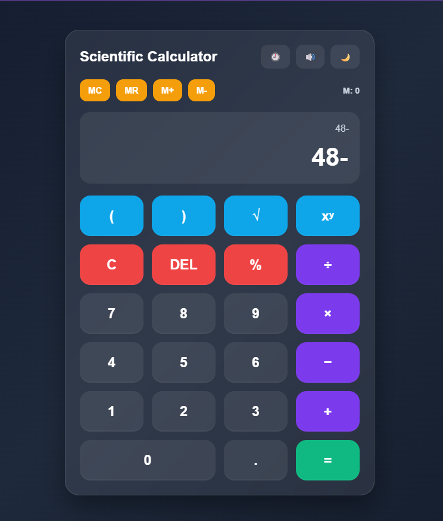

# Scientific Calculator

A modern scientific calculator built with HTML, CSS, and JavaScript.

## Screenshot

## Features
- Basic arithmetic operations
- Square root and power
- Brackets and percentage
- Memory buttons
- Calculation history
- Dark/light mode
- Keyboard support
- Responsive design

## Technologies Used
- HTML
- CSS
- JavaScript

## How to Run
Open `index.html` in your browser.